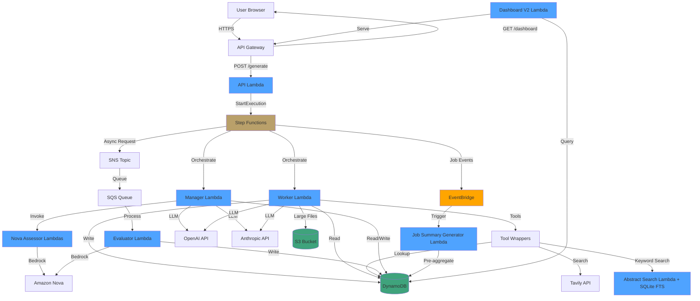

# TIL - Agent Workflow Observatory

**A production-grade platform for studying multi-agent AI behavior through real-world task execution.**

> **What makes AI agents succeed or fail?** TIL answers this by orchestrating multiple AI agents to generate conference abstracts while capturing every decision, tool call, and behavioral pattern. The abstracts are the *vehicle*; the observatory is the *purpose*.

---

## Why This Project Exists

Modern AI agents are increasingly autonomous, but understanding *why* they succeed or fail remains opaque. TIL provides a controlled environment to study:

- **Multi-vendor comparison**: How do OpenAI and Anthropic models perform in identical agentic tasks?
- **Tool usage patterns**: When do agents choose web search vs. database lookup? How does this affect quality?
- **Scoring calibration**: How do you build a fair evaluation system when AI evaluates AI?
- **Cost vs. quality tradeoffs**: What's the optimal budget for agent autonomy?

The conference abstract domain provides rich, measurable outputs with clear success criteria - making it ideal for systematic study.

---

## 📊 Research Findings: 700+ Runs

After running TIL over 700 times with controlled conditions, we discovered surprising patterns in how AI agents behave:

| Finding | Insight |
|---------|---------|
| **Anthropic vs OpenAI** | Anthropic shows higher variance (boom-or-bust), OpenAI delivers consistent but sometimes bland results |
| **Domain Sensitivity** | Black Hat (90% acceptance) vs Gartner (38%) - agents excel at technical security but struggle with business-forward messaging |
| **Evaluator Bias** | Blind evaluators reward aggressive/urgent framing over nuanced messaging |
| **Tool Adaptation** | Agents adjust tool usage per domain but can't escape stylistic priors |
| **First-Shot Success** | Jobs accepted on iteration 1 almost always succeed; iteration 2+ rejections predict failure |
| **Rhetorical Context** | The "Anthropic is formal, OpenAI is conversational" stereotype is **context-dependent** |

**Read the full analysis**: **[Research Findings](docs/research/RESEARCH-FINDINGS.md)**

These findings demonstrate TIL's value as a research platform - not just a generator, but an observatory for understanding AI agent behavior.

---

## Key Technical Achievements

### 1. Multi-Agent Orchestration with Step Functions

A **Manager-Worker-Evaluator** architecture where each agent has distinct responsibilities:

```
Manager (Orchestrator)          Worker (Executor)              Evaluator (Judge)
├── Formulates goals            ├── Autonomous tool selection  ├── Blind assessment
├── Self-assesses quality       ├── ReAct reasoning loop       ├── Conference prediction
├── Calls dual Nova scorers     ├── Artifact provenance        └── Decoy detection
└── Accept/reject decisions     └── Budget-aware execution
```

The Manager doesn't micromanage - it sets goals and evaluates outcomes. The Worker has full autonomy over *how* to achieve them.

### 2. Triple-Scoring System with Bias Correction

Instead of trusting a single LLM's judgment, we use **three independent assessors**:

| Assessor | Model | Role | Transform |
|----------|-------|------|-----------|
| Manager Self-Score | GPT-5.2 / Claude Sonnet 4.5 | Strategic judgment | Round up to nearest 0.5 |
| Nova Primary | Amazon Nova | Technical rigor | Round up to nearest 0.05 |
| Nova Secondary | Amazon Nova | Audience appeal | +0.25 flat boost |

**Why transforms?** Nova models exhibited a 7.83 clustering bias. The differential transforms break this pattern while preserving relative rankings.

### 3. Action Point Budget System

Rather than unlimited API calls, each job gets a **3-point budget per iteration**:

| Tool | Cost | Rationale |
|------|------|-----------|
| `search_abstracts` | 2 pts | High-value research |
| `web_search` | 1 pt | Supplementary context |
| `dynamodb_lookup` | 1 pt | Conference guidance |
| `red_team_review` | 1 pt | Quality assurance |
| `submit_abstract` | 0 pts | Final output |

This forces **strategic tool selection** - agents can't brute-force their way to quality.

### 4. Full Decision Traceability

Every agent decision is captured as a structured event:

```json
{
  "event_type": "WORKER_TOOL_CALLED",
  "job_id": "abc-123",
  "iteration": 2,
  "tool_name": "search_abstracts",
  "input": {"query": "kubernetes security multi-tenant"},
  "output": {"results": [...]},
  "latency_ms": 342,
  "action_points_remaining": 1
}
```

This enables **post-hoc analysis** of agent behavior patterns without instrumenting the agents themselves.

### 5. Dashboard V2: Research-Grade Analytics

A complete rewrite achieving **10x performance improvement** (320ms vs 3.2s):

- **Pre-aggregated data**: Job summaries computed at completion, not query time
- **Parallel GSI queries**: Fetch `completed` + `failed` jobs simultaneously
- **5-minute caching**: Instant repeat queries for interactive exploration
- **7 specialized dashboards**: Executive, Vendors (2), Context, Evaluator, Tools, Speed

---

## Architecture

### System Overview



### Technology Stack

| Layer | Technologies |
|-------|-------------|
| **Frontend** | React 18, TypeScript, Vite, Tailwind CSS, Recharts |
| **API** | AWS API Gateway, Lambda (TypeScript) |
| **Orchestration** | AWS Step Functions, EventBridge |
| **Compute** | AWS Lambda (Python 3.12) |
| **AI/ML** | OpenAI GPT-5.2, Anthropic Claude Sonnet 4.5, Amazon Nova |
| **Data** | DynamoDB, S3, CloudWatch |
| **Infrastructure** | AWS CDK (TypeScript), CloudFront |
| **Search** | SQLite FTS5 (200+ indexed abstracts) |

---

## Project Structure

```
til-agent-observatory/
├── packages/
│   ├── agents/                    # Python Lambda functions
│   │   ├── manager/               # Goal formulation, scoring, decisions
│   │   ├── worker/                # ReAct tool loop, artifact generation
│   │   ├── evaluator/             # Blind conference prediction
│   │   ├── assess-abstract-*/     # Nova scoring Lambdas
│   │   └── layers/                # Shared Python dependencies
│   ├── lambdas/                   # Standalone Lambda functions
│   │   └── abstract_search/       # SQLite FTS5 keyword search
│   ├── api/                       # TypeScript API handlers
│   │   └── src/handlers/          # REST endpoints
│   ├── frontend/                  # React dashboard application
│   │   └── src/
│   │       ├── pages/             # Dashboard, Workflow, Results
│   │       └── components/        # Reusable UI components
│   └── shared/                    # Shared libraries
│       ├── llm-client/            # OpenAI/Anthropic/Bedrock abstraction
│       ├── decision-events/       # Structured event logging
│       ├── budget-service/        # Action point tracking
│       └── tool-wrappers/         # Agent tool implementations
├── infrastructure/cdk/            # AWS CDK infrastructure
│   └── stacks/                    # API, Compute, Data, Workflow, Frontend
├── docs/                          # Comprehensive documentation
│   ├── research/                  # Research findings and observability
│   ├── architecture/              # System design documents
│   ├── dashboard/                 # Dashboard-specific docs
│   ├── guides/                    # Deployment and development guides
│   ├── prd/                       # Product requirements (6 epics)
│   └── stories/                   # 26 user stories
├── scripts/                       # Operational utilities
└── tests/                         # Integration test suites
```

---

## Documentation

### Research & Analysis
- **[Research Findings](docs/research/RESEARCH-FINDINGS.md)** - Key discoveries from 700+ controlled runs
- **[Observability Flow](docs/research/OBSERVABILITY-FLOW.md)** - How agent decisions become analytics insights

### Architecture & Design
- **[High-Level Architecture](docs/architecture/high-level-architecture.md)** - System overview and design decisions
- **[Database Schema](docs/architecture/database-schema.md)** - DynamoDB table designs
- **[REST API Specification](docs/architecture/rest-api-spec.md)** - API endpoints and contracts
- **[Workflow Dataflow Guide](docs/architecture/workflow-dataflow-guide.md)** - Step Functions state machine

### Guides
- **[Deployment Guide](docs/guides/DEPLOYMENT.md)** - How to deploy your own instance
- **[CDK Stacks Overview](docs/guides/CDK-STACKS-OVERVIEW.md)** - Infrastructure as code reference
- **[Models Reference](docs/guides/MODELS-REFERENCE.md)** - AI model strategy and rationale

### Dashboards
- **[Dashboard V2 Architecture](docs/dashboard/DASHBOARD-V2-COMPLETE-ARCHITECTURE.md)** - 10x performance optimization
- **[Frontend Integration Guide](docs/dashboard/DASHBOARD-V2-FRONTEND-INTEGRATION.md)** - React component patterns
- **[Scoring Analytics Guide](docs/dashboard/NOVA-SCORING-ANALYTICS-GUIDE.md)** - Understanding the metrics

### Product Requirements
- **[PRD Overview](docs/prd/index.md)** - Product requirements with 6 epics
- **[User Stories](docs/stories/)** - 26 detailed implementation stories

---

## Getting Started

### Prerequisites

- Node.js 20+ and npm
- Python 3.12+
- Docker (for Lambda layer builds)
- AWS CLI configured with appropriate credentials
- AWS Account (for deployment)

### Local Development

```bash
# Clone the repository
git clone https://github.com/YOUR_USERNAME/til-agent-observatory.git
cd til-agent-observatory

# Install dependencies
npm install

# Set up environment
cp packages/frontend/.env.example packages/frontend/.env.local
# Edit .env.local with your API Gateway URL

# Start frontend development server
cd packages/frontend && npm run dev
```

> **Note:** The frontend requires a deployed AWS backend. See [Deployment Guide](docs/guides/DEPLOYMENT.md) to set up the API before running locally.

### AWS Deployment

See **[Deployment Guide](docs/guides/DEPLOYMENT.md)** for complete instructions.

```bash
# Build Lambda layers (requires Docker)
./scripts/bundle-lambda-layers.sh

# Deploy all stacks
cd infrastructure/cdk
npm install
npx cdk deploy --all --profile YOUR_AWS_PROFILE
```

---

## Configuration

### Environment Variables

Create `.env.example` files for each environment:

**Frontend** (`packages/frontend/.env.example`):
```env
VITE_API_BASE_URL=https://YOUR_API_GATEWAY_ID.execute-api.us-east-1.amazonaws.com/prod
```

**AWS Secrets** (store in Parameter Store):
```
/conference-abstract/dev/anthropic-api-key
/conference-abstract/dev/openai-api-key
/conference-abstract/dev/tavily-api-key
```

### CDK Configuration

Update placeholder values in `infrastructure/cdk/stacks/`:
- `YOUR_AWS_ACCOUNT_ID` - Your AWS account
- `YOUR_ACM_CERTIFICATE_ID` - SSL certificate for custom domain
- `your-domain.example.com` - Your domain name
- `your-frontend-bucket` - S3 bucket for frontend assets

---

## License

MIT License - see [LICENSE](LICENSE) for details.

---

## Acknowledgments

Built as an exploration of multi-agent AI observability. The conference abstract generation domain was chosen for its measurable outputs and rich decision-making requirements.

**Key Design Influences:**
- ReAct (Reasoning + Acting) pattern for agent tool loops
- Stratified randomization for unbiased vendor comparison
- Pre-aggregation patterns for dashboard performance
