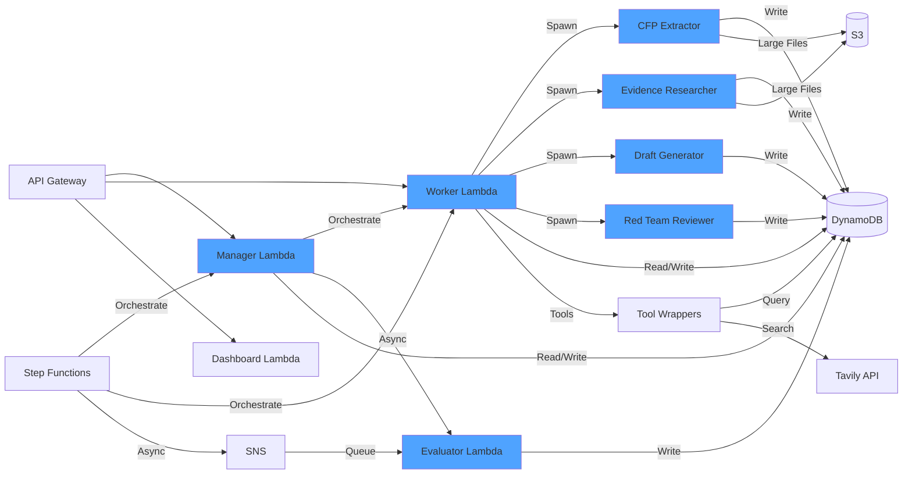

# Components

## Manager Lambda

**Responsibility:** Formulates high-level objectives, evaluates Worker output, and selects best iteration.

**Key Interfaces:**
- `formulate_goal(conference, topic) -> goal` - Creates high-level objective
- `evaluate_output(abstract, iteration, evaluator_result) -> feedback` - Evaluates and provides feedback
- `select_best_iteration(iterations[]) -> selected_iteration` - Chooses final output

**Dependencies:** 
- OpenAI or Anthropic API (assigned per job)
- DynamoDB (conference_data lookup, generation_metrics write)
- DynamoDB (vendor assignment tracking for stratification)

**Technology Stack:** Python 3.11, OpenAI SDK, Anthropic SDK, boto3

**Vendor Assignment Logic:**
- **Randomization:** 50/50 split between OpenAI and Anthropic for Manager/Worker roles
- **Opposite vendors:** Manager and Worker must be opposite vendors (enforced)
- **Stratification:** Track assignments by `conference` and `topic` to ensure balanced distribution
- **Assignment storage:** Stored in `jobs` table `vendor_assignment` field at job creation (immutable)
- **Audit logging:** `vendor_assigned` decision event logged to `decision_events` table
- **UI Blinding Strategy:** 
  - Vendor assignment hidden from user during initial request/objective formulation (reduces bias)
  - Vendor assignment revealed in UI after generation starts (when Manager begins execution)
  - Internal logging always includes vendor assignment (for analytics and transparency)
  - Dashboard shows vendor comparisons (aggregated data, not per-job blinding)

## Worker Lambda

**Responsibility:** Autonomously executes abstract generation strategy, spawns sub-workers, coordinates parallel execution.

**Key Interfaces:**
- `execute_strategy(goal, manager_feedback) -> abstract` - Main execution logic
- `spawn_sub_worker(type, inputs) -> artifact` - Spawns specialized sub-workers
- `synthesize_abstract(artifacts[]) -> abstract` - Combines sub-worker outputs

**Dependencies:**
- OpenAI or Anthropic API (assigned per job)
- DynamoDB (scratch_artifacts read/write)
- Tool wrappers (DynamoDB lookup, web search)
- Sub-worker Lambdas (async invocation)

**Technology Stack:** Python 3.11, OpenAI SDK, Anthropic SDK, boto3, asyncio

## Sub-Worker Lambdas (4 types)

**Responsibility:** Execute specialized bounded tasks and produce standardized artifacts.

**Types:**
1. **CFP/Style Extractor** - Analyzes conference style requirements
2. **Evidence Researcher** - Gathers recent trends and evidence
3. **Draft Generator** - Creates abstract candidates
4. **Red Team Reviewer** - Validates quality and identifies issues

**Key Interfaces:**
- `execute_task(inputs) -> artifact` - Produces artifact following standard envelope

**Dependencies:**
- OpenAI or Anthropic API (inherited from Worker)
- DynamoDB (conference_data, scratch_artifacts)
- Tool wrappers (DynamoDB lookup, web search - limited)
- Schema validator (pydantic)

**Technology Stack:** Python 3.11, OpenAI SDK, Anthropic SDK, boto3, pydantic

## Evaluator Lambda

**Responsibility:** Provides blind conference assessment (no context about target conference).

**Key Interfaces:**
- `assess_conference(title, abstract) -> top_3_predictions` - Returns top 3 conference matches

**Dependencies:**
- Amazon Bedrock (Nova model)
- DynamoDB (generation_metrics write)

**Technology Stack:** Python 3.11, boto3 (Bedrock)

## API Gateway Lambdas

**Responsibility:** Handle REST API requests and WebSocket connections.

**Key Interfaces:**
- `POST /generate` - Initiate generation
  - Returns `202 Accepted` if job enqueued or started
  - Client should immediately open WebSocket connection and poll `/status` as fallback if WebSocket fails
- `GET /status/{job_id}` - Poll job status (requires `job_read_token` - not public)
- `POST /feedback/{job_id}` - Submit user feedback (requires `job_read_token`)
- `GET /dashboard/{metric_type}` - Dashboard data (public aggregated data, no job-level traces)
- `GET /workflow/{job_id}` - Workflow events (requires `job_read_token`)
- `WebSocket /ws` - Real-time updates (connection management, requires `job_read_token`)

**Dependencies:**
- DynamoDB (jobs, generation_metrics, decision_events)
- Step Functions (job creation)
- WebSocket API (real-time events)

**Technology Stack:** Node.js 20.11.0, AWS SDK v3 (plain Lambda handlers, no Express.js for reduced overhead)

**WebSocket Connection Management:**
- On connection: Client sends `{job_id, token}` in query params
- Server verifies token, stores connection mapping in `ws_connections` table
- On disconnect: Cleanup connection mapping
- Connection TTL: 1 day (auto-cleanup stale connections)

## WebSocket Broadcast Lambda

**Responsibility:** Push real-time updates to WebSocket clients via API Gateway Management API.

**Key Interfaces:**
- `broadcast_to_job(job_id, message)` - Sends message to all connections for a job
- `handle_stale_connection(connection_id)` - Cleans up 410 Gone connections

**Dependencies:**
- DynamoDB (ws_connections table)
- API Gateway Management API (postToConnection)
- EventBridge (decision events trigger broadcasts)

**Technology Stack:** Node.js 20.11.0, AWS SDK v3

**Broadcast Flow:**
1. Decision events written to `decision_events` table
2. EventBridge rule triggers `ws-broadcast` Lambda
3. Lambda queries `ws_connections` table by `job_id`
4. For each `connection_id`, calls `ApiGatewayManagementApi.postToConnection()`
5. Handles 410 Gone errors (stale connections) by deleting from `ws_connections`
6. Retries failed sends with exponential backoff (max 3 retries)

**Connection Mapping:**
- Table: `ws_connections`
- Partition Key: `job_id` (String, UUID)
- Sort Key: `connection_id` (String, API Gateway connection ID)
- Attributes: `created_at` (ISO timestamp), `expires_at` (Unix timestamp for TTL)
- TTL: `expires_at` field (1 day from creation)

## Dashboard Lambda

**Responsibility:** Aggregates metrics for dashboard visualization with optimized query patterns.

**Key Interfaces:**
- `aggregate_daily_metrics(date)` - Nightly aggregation job
- `query_metrics(metric_type, filters)` - Dashboard queries with caching

**Dependencies:**
- DynamoDB (generation_metrics, daily_metrics, decision_events)
- CloudFront (response caching)

**Technology Stack:** Node.js 20.11.0, AWS SDK v3

**Query Strategy:**
- **Time-series data (last 30 days):** Query from `daily_metrics` (precomputed)
- **Today's data:** Query from `generation_metrics` using GSI on `date_partition`
- **Interactive filtering:** Lightweight aggregation in Lambda for small result sets
- **Caching:** CloudFront cache with 5-minute TTL for dashboard endpoints
- **Precomputed slices (future enhancement):** Store common slices in `daily_metrics`:
  - `acceptance_by_vendor_role`
  - `tool_usage_by_vendor_role`
  - `guardrail_rate_by_vendor_role`
  - `p50_p90_latency_by_conference_topic`

**Performance Targets:**
- Dashboard load: <3 seconds (p95)
- Query response: <2 seconds for aggregated data
- Cache hit rate: >80% for common queries

## Tool Wrappers

**Responsibility:** Provide controlled access to external tools with budget enforcement.

**Types:**
1. **DynamoDB Lookup** - Conference data queries (unlimited)
2. **Web Search** - Tavily API (budget-limited: 10 normal, 2 minimal mode)

**Key Interfaces:**
- `dynamodb_lookup(conference, data_type, filters) -> results`
- `web_search(query, job_id) -> results` (enforces budget)

**Dependencies:**
- DynamoDB (conference_data, job_budgets)
- Tavily API (external)

**Technology Stack:** Python 3.11, boto3, requests

**Cost Tracking Contract:**

Each tool wrapper and LLM wrapper MUST emit a `cost_event` decision event with:
```json
{
  "event_type": "cost_event",
  "actor": "worker|manager|sub_worker|tool",
  "provider": "openai|anthropic|bedrock|tavily",
  "model": "gpt-4|claude-3-5-sonnet|nova|tavily",
  "prompt_tokens": 1234,
  "completion_tokens": 567,
  "total_tokens": 1801,
  "usd_estimate": 0.042,
  "latency_ms": 1250,
  "timestamp": "2026-01-12T10:30:15.123Z"
}
```

**Cost Event Sources:**
- **OpenAI/Anthropic:** Token usage from API response (`usage.prompt_tokens`, `usage.completion_tokens`)
- **Bedrock:** Token usage from response metadata (if available) or estimated from model pricing
- **Tavily:** Per-call cost from pricing plan (fixed cost per search)

**Cost Aggregation:**
- `cost_event` decision events written to `decision_events` table
- `job_budgets` table updated atomically after each cost event
- Daily cost tracking via CloudWatch custom metric (sum of all job costs)

## Component Diagrams



---
