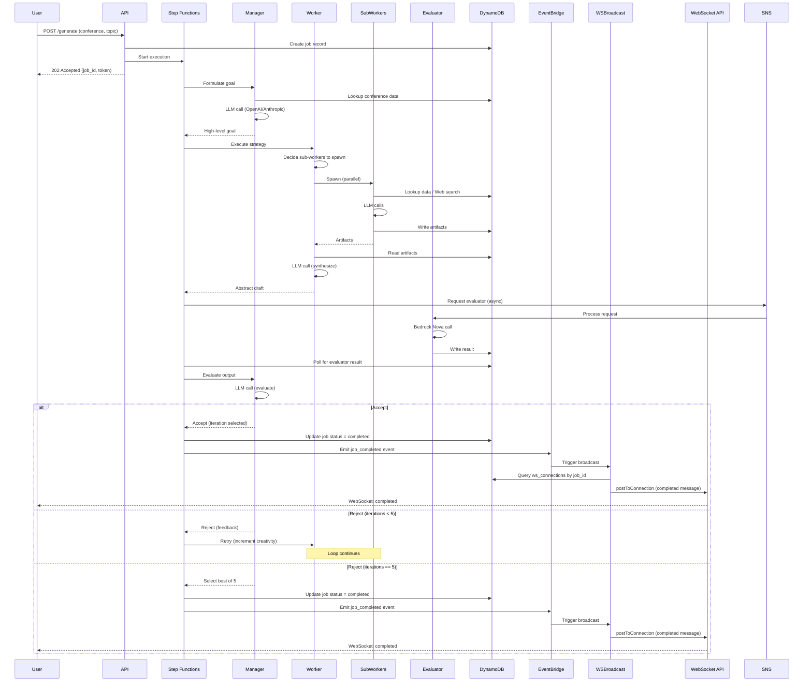
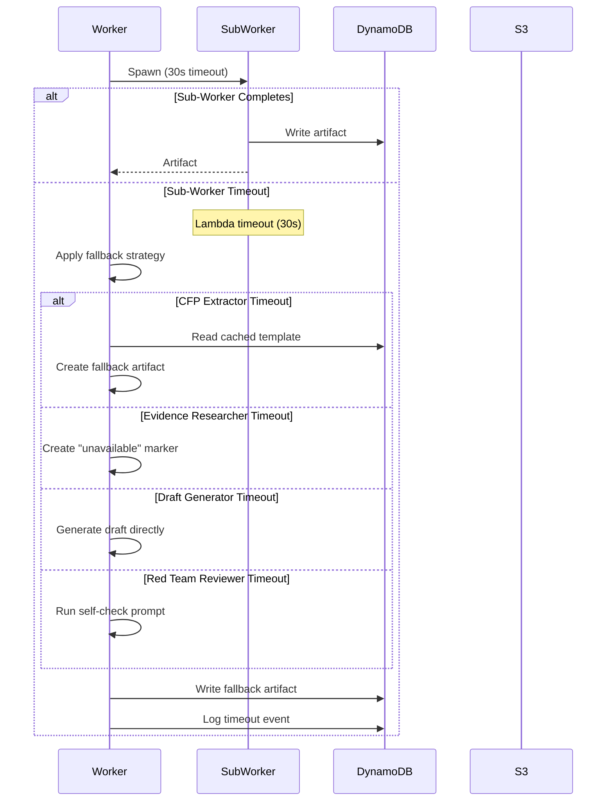

# Core Workflows

## Abstract Generation Workflow

```mermaid
sequenceDiagram
    participant User
    participant API
    participant SFN as Step Functions
    participant Manager
    participant Worker
    participant SubWorkers
    participant Evaluator
    participant DynamoDB
    participant EventBridge
    participant WSBroadcast
    participant WS as WebSocket API
    
    User->>API: POST /generate (conference, topic)
    API->>DynamoDB: Create job record
    API->>SFN: Start execution
    API-->>User: 202 Accepted (job_id, token)
    
    SFN->>Manager: Formulate goal
    Manager->>DynamoDB: Lookup conference data
    Manager->>Manager: LLM call (OpenAI/Anthropic)
    Manager-->>SFN: High-level goal
    
    SFN->>Worker: Execute strategy
    Worker->>Worker: Decide sub-workers to spawn
    Worker->>SubWorkers: Spawn (parallel)
    SubWorkers->>DynamoDB: Lookup data / Web search
    SubWorkers->>SubWorkers: LLM calls
    SubWorkers->>DynamoDB: Write artifacts
    SubWorkers-->>Worker: Artifacts
    
    Worker->>DynamoDB: Read artifacts
    Worker->>Worker: LLM call (synthesize)
    Worker-->>SFN: Abstract draft
    
    SFN->>SNS: Request evaluator (async)
    SNS->>Evaluator: Process request
    Evaluator->>Evaluator: Bedrock Nova call
    Evaluator->>DynamoDB: Write result
    SFN->>DynamoDB: Poll for evaluator result
    
    SFN->>Manager: Evaluate output
    Manager->>Manager: LLM call (evaluate)
    alt Accept
        Manager-->>SFN: Accept (iteration selected)
        SFN->>DynamoDB: Update job status = completed
        SFN->>EventBridge: Emit job_completed event
        EventBridge->>WSBroadcast: Trigger broadcast
        WSBroadcast->>DynamoDB: Query ws_connections by job_id
        WSBroadcast->>WS: postToConnection (completed message)
        WS-->>User: WebSocket: completed
    else Reject (iterations < 5)
        Manager-->>SFN: Reject (feedback)
        SFN->>Worker: Retry (increment creativity)
        Note over Worker,SubWorkers: Loop continues
    else Reject (iterations == 5)
        Manager-->>SFN: Select best of 5
        SFN->>DynamoDB: Update job status = completed
        SFN->>EventBridge: Emit job_completed event
        EventBridge->>WSBroadcast: Trigger broadcast
        WSBroadcast->>WS: postToConnection (completed message)
        WS-->>User: WebSocket: completed
    end
```

## Sub-Worker Timeout Fallback Workflow

```mermaid
sequenceDiagram
    participant Worker
    participant SubWorker
    participant DynamoDB
    participant S3
    
    Worker->>SubWorker: Spawn (30s timeout)
    alt Sub-Worker Completes
        SubWorker->>DynamoDB: Write artifact
        SubWorker-->>Worker: Artifact
    else Sub-Worker Timeout
        Note over SubWorker: Lambda timeout (30s)
        Worker->>Worker: Apply fallback strategy
        alt CFP Extractor Timeout
            Worker->>DynamoDB: Read cached template
            Worker->>Worker: Create fallback artifact
        else Evidence Researcher Timeout
            Worker->>Worker: Create "unavailable" marker
        else Draft Generator Timeout
            Worker->>Worker: Generate draft directly
        else Red Team Reviewer Timeout
            Worker->>Worker: Run self-check prompt
        end
        Worker->>DynamoDB: Write fallback artifact
        Worker->>DynamoDB: Log timeout event
    end
```

---
