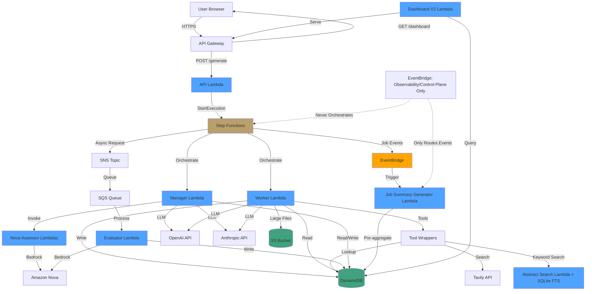

# High Level Architecture

## Technical Summary

The Conference Abstract Builder is a serverless, event-driven multi-agent system built on AWS. The architecture uses AWS Step Functions for orchestration, AWS Lambda for compute, DynamoDB for data storage, and S3 for large artifact storage. The system implements a Manager-Worker pattern with autonomous task decomposition, where agents make independent decisions about tool usage. All agent actions are captured as structured decision events for observability and analytics. The primary deliverable is an analytics dashboard that compares OpenAI vs. Anthropic performance in different agent roles. The architecture provides comprehensive cost guardrails to maintain budget constraints.

## High Level Overview

**Architectural Style:** Serverless with Event-Driven patterns

**Repository Structure:** Monorepo (single repository for all components)

**Service Architecture:** Serverless functions within a Monorepo

**Primary User Interaction Flow:**
1. User submits generation request via API Gateway
2. API Lambda starts Step Functions state machine execution
3. Manager agent formulates high-level goal
4. Worker agent autonomously decides execution strategy via tools
5. Nova Assessors provide dual-scoring evaluation
6. Evaluator provides blind conference assessment (async via SNS/SQS)
7. Manager evaluates and accepts/rejects (up to 3 iterations)
8. Results returned to user via REST API polling
9. All decision events captured for analytics dashboard

**Key Architectural Decisions:**
- **Step Functions for orchestration** (not EventBridge) - prevents "two captains" problem
- **DynamoDB for all data** - fast, scalable, serverless
- **S3 for large artifacts** - cost-effective storage for >350KB payloads
- **Python for agent Lambdas** - better LLM SDK support
- **Node.js for API/Frontend** - better ecosystem for web services
- **50/50 vendor randomization with stratification** - ensures scientific rigor in comparisons with balanced distribution across conferences/topics
- **Deterministic fallbacks** - every timeout has a defined recovery path

## High Level Project Diagram

## Architectural and Design Patterns

- **Serverless Architecture:** Using AWS Lambda for compute - _Rationale:_ Aligns with PRD requirement for cost optimization, automatic scaling, and pay-per-use model. Supports 500-2000 generations/day without infrastructure management.

- **Step Functions Orchestration:** Step Functions controls job state machine - _Rationale:_ Prevents "two captains" problem where both Step Functions and EventBridge try to control flow. Single source of truth for job lifecycle.

- **Event-Driven Decision Logging:** EventBridge emits decision events to DynamoDB - _Rationale:_ Decouples observability from orchestration. Allows real-time dashboard updates without blocking job execution.

- **EventBridge Pattern:** EventBridge is observability/control-plane only; it never controls orchestration. EventBridge routes job completion events to trigger the Job Summary Generator Lambda for pre-aggregation, but Step Functions remains the single source of truth for job flow control.

- **Repository Pattern for Data Access:** Abstract DynamoDB access through shared libraries - _Rationale:_ Enables testing, future database migration flexibility, and consistent error handling.

- **Standard Artifact Envelope:** All artifacts follow consistent structure (meta, data, quality_signals, provenance, overflow, execution) - _Rationale:_ Enables schema validation, traceability, and consistent handling across all artifact types.

- **Deterministic Fallback Strategy:** Every timeout has a predefined recovery path - _Rationale:_ Ensures 95%+ job completion rate even when sub-workers fail. No ad-hoc error handling.

- **Capability-Based Security:** job_read_token provides access to job data - _Rationale:_ Lightweight security model for MVP. No user authentication required, but prevents enumeration attacks.

---
